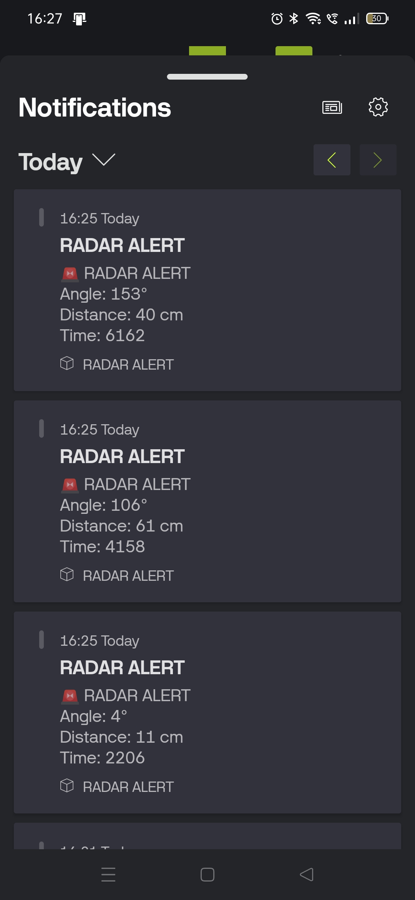
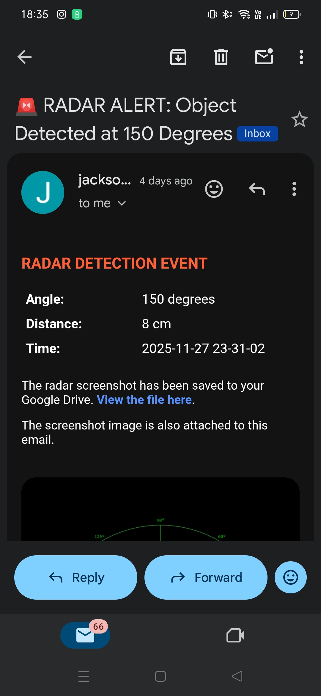

# 🎯 Arduino-Powered Smart Motion Detecting Turret

_A servo-driven ultrasonic scanning system that detects objects in real time, alerts the user instantly via buzzer and app/email notifications, and visualizes the scan as a live radar on a PC using Processing 3._

---

## 📌 Table of Contents
- [Overview](#overview)
- [Problem Statement](#problem-statement)
- [Objectives](#objectives)
- [Tools & Technologies](#tools--technologies)
- [Hardware Components](#hardware-components)
- [System Architecture](#system-architecture)
- [How It Works](#how-it-works)
- [Radar Visualization (Processing 3)](#radar-visualization-processing-3)
- [Notifications (Blynk IoT)](#notifications-blynk-iot)
- [Results Obtained](#results-obtained)
- [How to Run This Project](#how-to-run-this-project)
- [Future Scope](#future-scope)
- [References](#references)
- [Team & Guidance](#team--guidance)

---

## Overview

This project detects motion/objects automatically using an ultrasonic sensor mounted on a servo motor that sweeps a defined angular range, similar to a radar scan. The Arduino handles sensing, sweep control, and buzzer alerts, while an ESP32 pushes real-time notifications (angle, distance, timestamp) to a phone via the **Blynk IoT** app and email. In parallel, the same serial data is streamed to a PC and rendered as a **live animated radar display** built in **Processing 3** — giving a visual, sweeping "detected object" view instead of just raw numbers on an LCD.

---

## Problem Statement

Low-cost, real-time object/motion detection is useful in security, robotics, and automation, but most simple ultrasonic setups only report a single static distance value with no visual context and no remote alerting. This project addresses that by:
- Continuously scanning an angular field of view instead of a single fixed direction
- Giving the user an intuitive **visual radar** of what the sensor sees, not just numbers
- Sending **instant remote notifications** the moment an object is detected
- Triggering a **local audible alarm** when an object crosses a safety threshold distance

---

## Objectives

1. Implement a servo-controlled sweep mechanism using an ultrasonic sensor for comprehensive environmental scanning and real-time data capture.
2. Establish a notification mechanism to instantly transmit captured object distance and angular position to the user (app + email).
3. Integrate an active buzzer to provide immediate, audible alerts whenever an object is successfully detected.
4. Visualize the scan data as a live radar sweep on a PC using Processing 3, so detections can be seen spatially in real time.

---

## Tools & Technologies

| Category | Tool |
|---|---|
| Firmware / Embedded | Arduino IDE (C/C++) |
| Microcontrollers | Arduino UNO, ESP32 |
| Remote Notifications | Blynk IoT (app + email alerts) |
| Desktop Visualization | Processing 3 (Java-based radar GUI) |
| Communication | UART Serial (Arduino ↔ PC), Wi-Fi (ESP32 ↔ Blynk) |
| Filtering | Kalman filter (signal smoothing on both firmware & radar side) |

---

## Hardware Components

- **Arduino UNO** — ATmega328P, 16 MHz, 32 KB Flash, 14 digital / 6 analog pins, 5V logic
- **HC-SR04 Ultrasonic Sensor** — 40 kHz, 2–400 cm range, ~3 mm accuracy, ~15° beam angle
- **SG90 Micro Servo Motor** — 0°–180° sweep, ~1.8–2.5 kg·cm torque, PWM control @ 50 Hz
- **ESP32 Module** — Wi-Fi 802.11 b/g/n + BLE, used for pushing notifications to Blynk
- **I2C Module** — for driving the 16×2 LCD over 2 wires (SDA/SCL) instead of 6+
- **16×2 LCD Display** — local readout of live distance/angle/system status
- **Active Buzzer** — instant audible alert on threshold breach
- **Breadboard** — solder-free prototyping

---

## System Architecture

```
                 ┌────────────────────┐
                 │   HC-SR04 Sensor    │
                 │  (Trig / Echo)      │
                 └─────────┬──────────┘
                           │
                 ┌─────────▼──────────┐        Serial (USB)      ┌──────────────────────┐
Servo (SG90) ◄───┤     Arduino UNO     ├─────────────────────────►│  Processing 3 Radar   │
   (sweep)        │  - sweep control    │                          │  GUI (PC/laptop)      │
                  │  - distance calc    │                          └──────────────────────┘
                  │  - Kalman filter    │
                  │  - buzzer trigger   │
                  │  - LCD (via I2C)    │
                  └─────────┬──────────┘
                            │ TX/RX
                  ┌─────────▼──────────┐        Wi-Fi             ┌──────────────────────┐
                  │     ESP32 Module    ├─────────────────────────►│   Blynk IoT Cloud     │
                  │  (relays detection  │                          │  → App + Email Alert │
                  │   angle/distance)   │                          └──────────────────────┘
                  └────────────────────┘
```

---

## How It Works

1. The ultrasonic sensor is mounted on the servo, which sweeps it smoothly across a defined angle range (e.g. 0°–180°).
2. At each angle step, the Arduino triggers the HC-SR04 and measures the echo return time to compute distance.
3. Raw readings are smoothed using a **Kalman filter** to remove sensor jitter/noise before being used.
4. Each (angle, distance) pair is timestamped and paired to form a coordinated data point representing the scanned environment.
5. If an object's distance falls below the predefined safety threshold, the Arduino immediately drives the **buzzer** for a local audible alert.
6. The same detection event (angle, distance, timestamp) is forwarded to the **ESP32**, which pushes it to **Blynk** for an instant push notification and email.
7. Simultaneously, the Arduino streams live serial data (angle + distance) over USB to a PC running the **Processing 3 radar sketch**, which renders it as a sweeping radar visualization in real time.

---

## Radar Visualization (Processing 3)

This is the desktop companion to the Arduino firmware — a **Processing 3** sketch that reads the live serial stream (`Serial.bufferUntil('\n')`) and renders it as an animated radar screen, so detections can be understood visually instead of as raw numbers.

**Features implemented in the radar GUI:**
- **Sweeping radar arc (0°–180°)** with labeled angle lines (0°, 30°, 60°, 90°, 120°, 150°, 180°) and range rings labeled in cm (5/10/15/20 cm), matching the sensor's real detection range
- **Heatmap rings** — concentric range rings that glow based on recent detection density, giving a "how active is this zone" feel
- **Live sweep glow** — a fading trail behind the current scan angle, like a classic radar sweep
- **Detection triangle** — highlights the live beam cone at the angle where an object is currently detected
- **Prediction indicator** — projects where the tracked object is likely heading, based on smoothed angle/distance history
- **Kalman filtering (client-side)** — `updateKalmanFilter()` smooths the incoming angle/distance stream so the radar needle doesn't jitter
- **Detection history trail** — recent detections persist briefly on screen (`drawHistory()`), and auto-clear if no new detection occurs for a timeout period
- **HUD overlay** — shows current sweep angle and sensor range info live
- **Clear History button** — an on-screen UI button to manually wipe the radar's detection trail

**How it connects:** the sketch opens a serial port to the Arduino (e.g. `new Serial(this, "COM3", 115200)`), buffers incoming lines, parses angle/distance pairs, and redraws the radar every frame in `draw()`.

> 📷 Example of the radar running live during testing:


---

## Notifications (Blynk IoT)

Whenever an object is detected within the threshold range, the system sends a structured alert (`RADAR ALERT` with Angle, Distance, and Time) which the user receives as:
- An **in-app push notification**, and a running **notification history** so past detection events (angle, distance, timestamp) can be reviewed later
- An **email alert** with the same detection details, which also **saves a screenshot of the live radar screen to Google Drive** at the moment of detection and attaches that screenshot image directly to the email

This ensures the user is aware of detections even when they aren't looking at the LCD or the radar screen, and every alert comes with a visual record of exactly what the radar saw.

**In-app notification history (multiple detection events logged over time):**



**Email alert with attached radar screenshot + Google Drive save confirmation:**



---

## Results Obtained

- The system accurately detected objects within the scanning area and tracked their position as the servo rotated.
- Detections within the threshold range triggered the buzzer instantly for local audible alerts.
- Detections were relayed to the user in near real time via Blynk app and email notifications.
- The Processing radar GUI updated live and in sync with the physical sweep, with smoothing (Kalman filter) removing sensor jitter from the display.
- Continuous scanning, buzzer alerts, remote notifications, and the radar visualization all worked together without noticeable delay, demonstrating stable overall system performance.
- Multiple detection events were logged consecutively (different angles and distances across separate test runs), confirming the alert pipeline holds up under repeated, back-to-back detections rather than just a single one-off test.

---

## How to Run This Project

1. **Flash the Arduino firmware**
   - Open the sketch in Arduino IDE
   - Select board: Arduino UNO, correct COM port
   - Upload

2. **Set up Blynk**
   - Create a Blynk template/device for the ESP32
   - Add your Wi-Fi credentials and Blynk auth token to the ESP32 sketch
   - Upload the ESP32 sketch

3. **Run the radar GUI**
   - Open the Processing sketch in Processing 3
   - Update the serial port name (e.g. `"COM3"`) to match your Arduino's port
   - Press Run — the radar window will open and begin scanning live

4. **Test detection**
   - Move an object within range in front of the sensor
   - Confirm: LCD updates → buzzer sounds (if within threshold) → Blynk app/email alert arrives → radar GUI shows the detection sweep

---

## Future Scope

- Add a camera + basic object classification for smarter target discrimination
- Log detection history to a file/database for later analysis
- Add auto-tracking (servo follows the object instead of just sweeping)
- Extend range using stronger/longer-range ultrasonic or ToF sensors

---

## References

- Gogoi, P., Barman, M., Deka, M., Rajkonwar, U., & Moudgollya, R. (2022). *Object Detection and Tracking Turret based on Cascade Classifiers and Single Shot Detectors.* 2022 International Conference on Computational Performance Evaluation (ComPE), pp. 792–796. IEEE.
- Loo, K. L., Chong Keat Saw, & Ibrahim, M. H. (2022). *A Fast and Flexible Turret Based Automated Vision Inspection (AVI).* pp. 45–51. Springer Singapore.
- Louali, R., Djilali Negadi, R., Hamadouche, R., & Nemra, A. (2022). *Design of a Vision-Based Autonomous Turret.* Journal of Automation, Mobile Robotics and Intelligent Systems, 72–77.
- Karlson, M., Ban, H., Cole, D. G., Abdelhakim, M., & Forsythe, J. (2023). *Aiming Error Analysis of Controlled Turret System With AI Target Recognition.* International Journal of Control, Automation and Systems.

---

## Team & Guidance

**Mini Project — Visvesvaraya Technological University, Belagavi (2025–2026)**
J N N College of Engineering, Shivamogga — Department of Electronics & Communication Engineering

| USN | Name |
|---|---|
| 4JN23EC061 | Prajwal S |
| 4JN23EC047 | Manojkumar N K |
| 4JN23EC045 | Lekhan B G |
| 4JN23EC034 | Jayachandran G |

**Guide:** Mrs. Smitha S M, Department of Electronics & Communication Engineering
